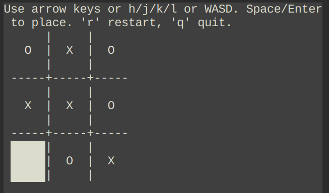

# ncurses-tic-tac-toe
A simple terminal-based Tic-Tac-Toe game built with ncurses in C, featuring:

- **Keyboard navigation** (arrow keys, `WASD`, or `h/j/k/l`).
- **Animated winning line** drawn across the winning row, column, or diagonal.
- **Unbeatable bot** powered by a clear and straightforward algorithm

## Screenshots


## Features
- Play as **X**, bot plays as **O**.
- Clear, human-readable AI logic.
- Smooth animation for win indication.

## Controls
| Key             | Action                                  |
|-----------------|-----------------------------------------|
| Arrow keys / WASD / h/j/k/l | Move cursor                 |
| Space / Enter   | Place your piece (X)                    |
| `r`             | Restart the game                        |
| `q`             | Quit the game                           |

## Build & Run
Requires **ncurses** library.

```bash
mkdir build
cd build
cmake ..
cmake --build .
./tictactoe
```

On Debian/Ubuntu, install ncurses with:
```bash
sudo apt install libncurses5-dev libncursesw5-dev
```

On Fedora:
```bash
sudo dnf install ncurses-devel
```

## License
This project is licensed under the MIT License – see the [LICENSE](LICENSE) file for details.